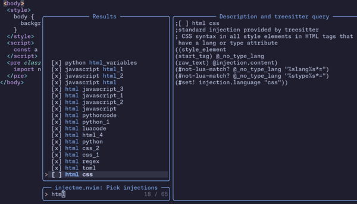

# injectme.nvim - Language highlights in your code

With [neovim](https://neovim.io/), you can show parts of your code as other code languages, e.g. a string that contains javascript code, or a python docstring that contains restructured text:

<p align="center">
  
</p>

[nvim-treesitter](https://github.com/nvim-treesitter/nvim-treesitter) already does this for a lot of use cases. With this plugin, you can toggle pre-set and custom language injections in your session. When you are happy with the settings, save 💽 them in the `queries`-folder in your config  and 🗑️ *delete this plugin*.

With the `:InjectmeToggle` command, you get a [Telescope](https://github.com/nvim-telescope/telescope.nvim) picker (see [Commands](#commands) for details) to change the injections in your session:

<p align="center">
  
</p>


## Installation

Use a package manager, e.g. [lazy.nvim](https://github.com/folke/lazy.nvim).
Requires Neovim >= v0.9.4 

```lua
{
  'Dronakurl/injectme.nvim',
  dependencies = {
    "nvim-treesitter/nvim-treesitter",
    "nvim-lua/plenary.nvim",
    "nvim-telescope/telescope.nvim",
  },
  -- This is for lazy load and more performance on startup only
  cmd = { "InjectmeToggle", "InjectmeSave", "InjectmeInfo" , "InjectmeLeave"},
}
```

## Commands

- `InjectmeToggle`: With no arguments, the picker window is started. With tab completion, you can also directly set lanuage and injection, e.g. `:InjectmeToggle python rst_for_docstring`
- `InjectmeSave`: Saves the injections settings to your runtime. When you are happy with this setting and do not want to change it dynamically any more, you can safely delete the plugin, the injections will continue to work.
- `InjectmeLeave`: The plugin saves your settings locally in the `.local/share/nvim/state_injectme.lua` file. When you want to delete the plugin, you can use this to clean up. 
- `InjectmeInfo`: Display current configured injections in the messages

## Available custom injection queries

*🚧 This is only stuff for my use cases or for testing, please [contribute](#Contribution) 🚧*

### python
- `rst_for_docstring`: Python docstring is shown as restructured text
- `javascript_variables`: All string variables ending with `js` are shown as javascript
- `css_variables`: All string variables ending with `css` are shown as css
- `html_variables`: All string variables ending with `html` are shown as html
- `style_attribute_css`: All strings in a `.style('somethin')` attribute are shown as css
- `loads_attribute_json`: All strings in a `.loads('somethin')` attribute are shown as json

### markdown
- `codeblocks_as_lua`: All code blocks are shown as lua

### html
- `pythoncode`: All text in a `pre` tag with class `python` is shown as python

## (Optional) Configuration

Setup calling `setup()`. This is *optional* and below are standard values for all further settings.

```lua 
require("injectme").setup({
  mode = "standard", 
  -- "all"/ "none" if all/no injections should be activated on startup
  --    When you use, lazy loading, call :InjectemeInfo to activate
  -- "standard", if no injections should be changed from standard settings in 
  --    the runtime directory, i.e. ~/.config/nvim/queries/<language>/injections.scm
  reload_all_buffers = true, 
  -- after toggling an injection, all buffers are reloaded to reset treesitter
  -- you can set this to false, and avoid that the plugin asks you to save buffers 
  -- before changing an injection
  reset_treesitter = true,
  -- after toggling an injections, the treesitter parser is reset
  -- Currently, this does nothing, see this discussion on github
  -- https://github.com/nvim-treesitter/nvim-treesitter/discussions/5684
})
```

## Why this plugin?

I created this plugin so it is easier to get started with custom injections in treesitter. Another way would be just to set up the treesitter config on your own. I found this tedious(*) and decided to provide this config-kickstart plugin. (*: Now, I found that nvim-treesitter is not really hard to configure after 🤦 reading the docs 📖 and I have doubts if this plugin will be useful to anyone. Maybe, the following list is 🙂)

Here are the steps, if you want to do this without this plugin: 
1. Install [nvim-treesitter/nvim-treesitter](https://github.com/nvim-treesitter/nvim-treesitter)
1. Install [nvim-treesitter/playground](https://github.com/nvim-treesitter/playground)
1. Read the [docs of the treesitter query language](https://tree-sitter.github.io/tree-sitter/using-parsers#query-syntax) 
1. Read the `:treesitter-language-injections`
1. Get some inspiration for queries from the standard injections in `~/.local/share/nvim/lazy/nvim-treesitter/queries/{language}/injections.scm`
1. Start treesitter playground with `:TSPlaygroundToggle`, and try out queries
1. Open the file injections files by `:TSEditQueryUser injections markdown`, for example
1. Put your queries there and do not forget the `;extends` comment on top, when you want to keep the standard queries provided by nvim-treesitter

💡 Another reason: I was inspired to make a plugin by this [YouTube video about plugin development](https://www.youtube.com/watch?v=n4Lp4cV8YR0). 

## Contribution
All contributions are welcome! 
- In particular, please submit useful injections in the file [preset_injections.lua](lua/injectme/preset_injections.lua).
- If you don't change injections, all your custom injections are read from your `queries` folders in your runtime as well and can be toggled. New injections are only included in the above settings file after it was deleted first (with `InjectmeLeave`).

