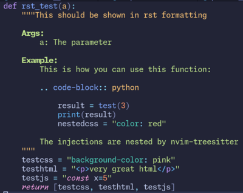

<!-- # This is work in progress -->
<!-- Experiencing minor difficulties... Please do not use yet. It was a mistake to publish as yet -->
<!---->
<!-- <p align="center"> -->
<!--    -->
<!-- </p> -->


# InjectMe - Other language highlights in your code

With this plugin, you can show parts of your code as other code languages, e.g. strings or comments.

<p align="center">
  
</p>

[nvim-treesitter](https://github.com/nvim-treesitter/nvim-treesitter) already does this for a lot of use cases. This plugin can help you get started to explore more customisation options. It sets custom language injections in the `queries`-folder in your config. When you are happy with the settings, save them and _delete this plugin_.

## Requirements

Neovim >= v0.9.4 

## Installation

Use a package manager, e.g. [lazy.nvim](https://github.com/folke/lazy.nvim)

```lua
{
  'Dronakurl/injectme.nvim',
  opts = {}, -- Set the configuration, optional, see below
  dependencies = { "nvim-treesitter/nvim-treesitter" },
  -- This is for lazy load performance on startup only
  cmd = { "InjectmeToggle", "InjectmeSave", "InjectmeInfo" },
}
```

## Commands

- `InjectmeToggle`: Toggles one of the pre-configured language injections, use tab completion
- `InjectmeSave`: Saves the selected injections to your runtime, set mode to "standard". When you are happy with this setting and do not want to change it dynamically, you can safely delete the plugin, the injections will continue to work.
- `InjectmeReset`: The plugin saves your settings locally in the `.local/share/nvim/injectme.lua` file. When you want to delete the plugin, you can use this to clean up

## Injections
### python
- `rst_for_docstring`: Python docstring is shown as restructured text
- `javascript_variables`: All string variables ending with `js` are shown as javascript
- `css_variables`: All string variables ending with `css` are shown as css
- `html_variables`: All string variables ending with `html` are shown as html
- `style_attribute_css`: All strings in a `.style('somethin')` attribute are shown as css
- `loads_attribute_json`: All strings in a `.loads('somethin')` attribute are shown as json

### markdown
- `codeblocks_as_lua`: All code blocks are shown as lua

### html
- `pythoncode`: All text in a `pre` tag with class `python` is shown as python

## (Optional) Configuration

Setup calling `setup()`. This is optional and below are standard values for further settings.

```lua 
require("injectme").setup({
  mode = "standard", 
  -- "all"/ "none" if all/no injections should be activated
  -- "standard", if no injections should be changed from standard settings in 
  -- the runtime directory, i.e. ~/.config/nvim/after/queries/<language>/injections.scm
  reload_all_buffers = true, 
  -- after toggling an injection, all buffers are reloaded to reset treesitter
  reset_treesitter = true,
  -- after toggling an injections, the treesitter parser is reset
  -- Currently, this does nothing, see this discussion on github
  -- https://github.com/nvim-treesitter/nvim-treesitter/discussions/5684
})
```

## Why this plugin?

I created this plugin so it is easier to get started with custom injections in treesitter. Another way would be just to set up the treesitter config on your own. I found this rather difficult and decided to provide this kickstart plugin, which you can delete, once you are happy.

Here are the steps, if you want to do this without this plugin: 
1. Install [nvim-treesitter/nvim-treesitter](https://github.com/nvim-treesitter/nvim-treesitter)
1. Install [nvim-treesitter/playground](https://github.com/nvim-treesitter/playground)
1. Read the [docs of the treesitter query language](https://tree-sitter.github.io/tree-sitter/using-parsers#query-syntax) 
1. Read the `:treesitter-language-injections`
1. Get some inspiration for queries from the standard injections in `~/.local/share/nvim/lazy/nvim-treesitter/queries/{language}/injections.scm`
1. Start treesitter playground with `:TSPlaygroundToggle`, and try out queries
1. Open the file injections files by `:TSEditQueryUser injections markdown`, for example
1. Put your queries there and do not forget the `;extends` comment on top, when you want to keep the standard queries provided by nvim-treesitter

Another reason: I wanted to try neovim plugin after watching this [YouTube video](https://www.youtube.com/watch?v=n4Lp4cV8YR0).  

## Contributions
All contributions are welcome! You can also submit ideas for useful injections.
